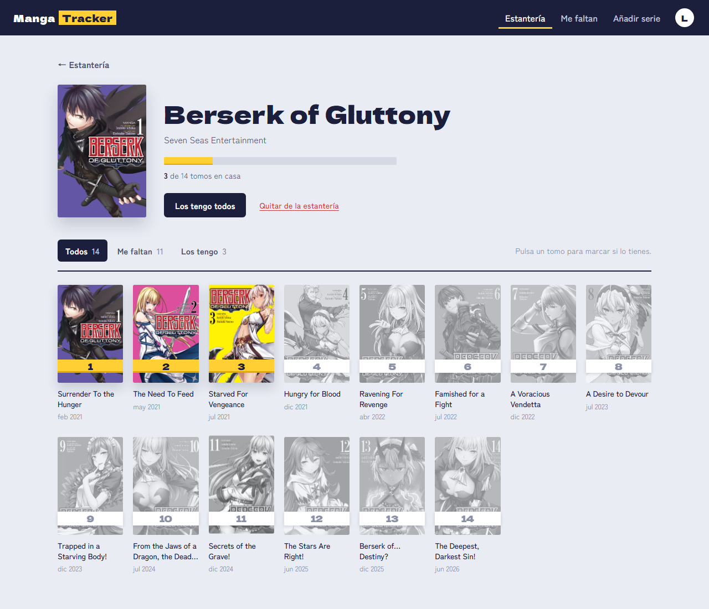
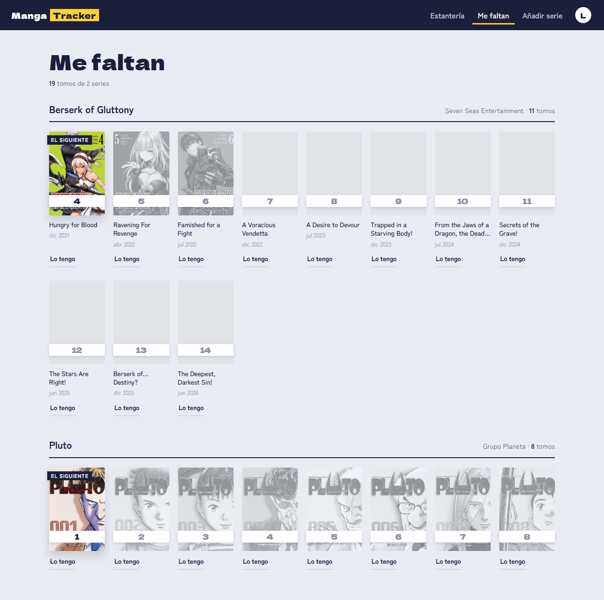
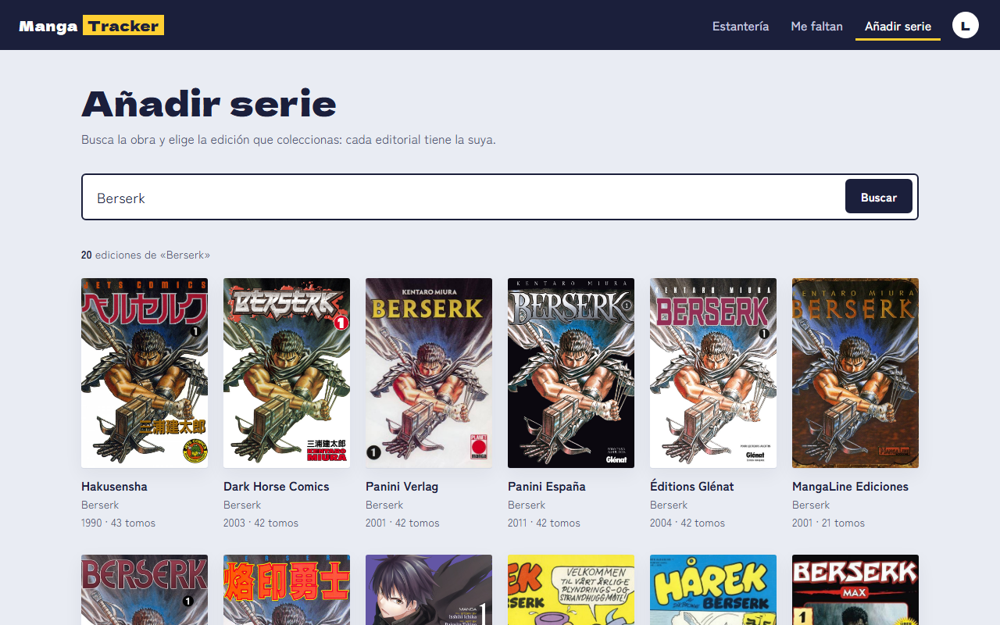
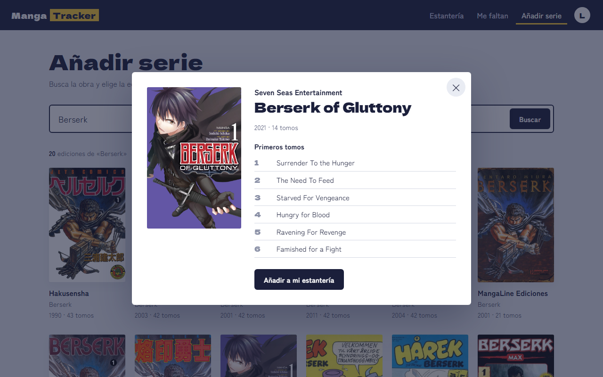
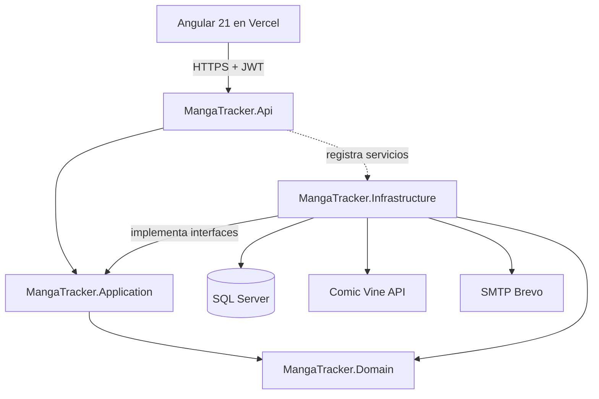

# Manga Tracker

[](https://github.com/Yuren92/MangaTracker/actions/workflows/ci.yml)


Aplicación web para llevar una colección física de manga: buscas una edición en Comic Vine, la importas con todos sus tomos, marcas los que tienes y ves de un vistazo los que te faltan. Cuando la editorial publica un tomo nuevo, la colección se sincroniza sola y el tomo aparece como pendiente.

Es un proyecto personal con el que quería practicar lo que no aparece en un CRUD: autenticación propia con revocación de sesiones, una integración externa que falla a mitad, concurrencia entre usuarios, y una pirámide de tests completa con CI.

**Demo:** [manga-tracker-teal.vercel.app](https://manga-tracker-teal.vercel.app) · **API:** [mangatracker.runasp.net/health](https://mangatracker.runasp.net/health)

| Una serie en la estantería | Me faltan |
| --- | --- |
|  |  |
| **Añadir serie: cada editorial es una edición** | **Vista previa antes de añadirla** |
|  |  |

Las capturas son de la aplicación real y se regeneran con Playwright (`frontend/manga-tracker-web/e2e/screenshots.spec.ts`).

## Qué demuestra este proyecto

* **Arquitectura por capas sin ceremonia.** Domain, Application, Infrastructure y Api con dependencias hacia el dominio; casos de uso explícitos sin MediatR; repositorios específicos, un [Unit of Work](src/MangaTracker.Infrastructure/Persistence/EfUnitOfWork.cs) y [consultas de lectura](src/MangaTracker.Infrastructure/Queries/CollectionQueries.cs) proyectadas en SQL.
* **Seguridad pensada y probada.** Revocación de JWT al cambiar la contraseña con un [`SecurityStamp`](src/MangaTracker.Api/Auth/SecurityStampValidator.cs); tokens de un solo uso guardados como hash; sin enumeración de cuentas (misma respuesta y mismo coste, con los correos enviados [en segundo plano](src/MangaTracker.Infrastructure/Email/BackgroundEmailSender.cs) para que el SMTP no delate qué emails existen); protección SSRF en el [cliente de Comic Vine](src/MangaTracker.Infrastructure/ExternalServices/ComicVine/ComicVineClient.cs); rate limiting por usuario; configuración validada al arrancar.
* **Datos externos que fallan.** Reintentos, timeouts y circuit breaker con Polly; 404 frente a 503; importación reanudable e idempotente; importaciones simultáneas resueltas con el índice único y un reintento.
* **Un buen cliente de una API ajena.** Las peticiones a Comic Vine se espacian al menos un segundo (su límite real, según su foro), el `420` con el que limita no se reintenta y abre el circuito, `field_list` pide solo los campos usados, y los tomos se leen en páginas de 100: importar un volumen de 193 tomos cuesta 3 peticiones en lugar de 194.
* **Concurrencia probada contra SQL Server.** Un enlace de un solo uso enviado por cinco peticiones a la vez solo funciona una vez (concurrencia optimista sobre `UsedAt`); el test reproduce la carrera y fallaba antes del arreglo.
* **Tests en tres niveles.** Unitarios, integración contra SQL Server real con `WebApplicationFactory` (autenticación, IDOR, concurrencia, caducidad de tokens) y end-to-end con Playwright. Cobertura de líneas del 80 al 91 % según el proyecto.
* **CI que bloquea.** Build con warnings como errores, auditoría de dependencias vulnerables y tests contra un contenedor de SQL Server en cada push.
* **Decisiones documentadas.** Lo que no se ha hecho también está razonado: [decisiones y limitaciones conocidas](#decisiones-y-limitaciones-conocidas).

## Funcionalidades

* Registro con confirmación por email (y reenvío del enlace), login, cambio y recuperación de contraseña (correos reales con Brevo).
* Búsqueda de ediciones en Comic Vine, vista previa e importación con todos sus tomos.
* Colecciones por usuario: marcar tomos uno a uno o todos, ver pendientes de todas las colecciones, eliminar colecciones.
* Sincronización automática con Comic Vine para incorporar tomos nuevos.
* API con errores `ProblemDetails`, rate limiting y health check; frontend responsive.

## Stack tecnológico

### Backend

* ASP.NET Core
* C#
* Entity Framework Core
* SQL Server
* JWT Bearer Authentication
* ASP.NET Core Rate Limiting
* ASP.NET Core Health Checks
* SMTP para envío de correos
* Microsoft.Extensions.Http.Resilience (Polly)
* xUnit, AwesomeAssertions, NSubstitute
* WebApplicationFactory contra SQL Server real

### Frontend

* Angular
* Standalone components
* Signals
* Control flow moderno con `@if` / `@for`
* TypeScript
* SCSS
* Vitest para tests unitarios
* Playwright para tests end-to-end
* Build desplegado en Vercel

### APIs externas

* Comic Vine API
* Brevo SMTP

### Infraestructura

* Frontend desplegado en Vercel.
* Backend desplegado en MonsterASP.NET.
* Base de datos SQL Server remota.
* Frontend y API comunicados directamente por HTTPS, con CORS restringido al origen del frontend.
* CI con GitHub Actions: build, auditoría de dependencias y tests contra SQL Server en contenedor.

## Estructura del proyecto

```txt
src/
  MangaTracker.Api
  MangaTracker.Application
  MangaTracker.Domain
  MangaTracker.Infrastructure

frontend/
  manga-tracker-web

tests/
  MangaTracker.Tests
```

## Arquitectura

El backend sigue una arquitectura por capas inspirada en Clean Architecture y DDD. Las dependencias apuntan hacia el dominio: Application define interfaces y Infrastructure las implementa.



### `MangaTracker.Domain`

Contiene el modelo de dominio y las entidades principales de negocio.

Entidades principales:

* `User`
* `UserToken`
* `Series`
* `Edition`
* `Tome`
* `UserCollection`
* `UserOwnedTome`

El dominio encapsula reglas básicas como validaciones de entidades, normalización de datos y actualización de detalles de ediciones y tomos.

### `MangaTracker.Application`

Contiene los casos de uso de la aplicación.

Incluye:

* Commands
* Queries
* Handlers
* DTOs
* Excepciones de aplicación
* Abstracciones de repositorios
* Abstracciones para servicios externos

Ejemplos:

* Registro de usuario.
* Login.
* Confirmación de email.
* Recuperación de contraseña.
* Importación de volúmenes desde Comic Vine.
* Marcado de tomos como comprados.
* Eliminación de colecciones.
* Sincronización de colecciones.
* Consulta de tomos pendientes.

Esta capa define las interfaces necesarias, pero no depende de detalles técnicos de infraestructura.

### `MangaTracker.Infrastructure`

Contiene las implementaciones técnicas.

Incluye:

* `DbContext` de Entity Framework Core.
* Repositorios SQL Server.
* Cliente HTTP para Comic Vine.
* Generación de JWT.
* Hashing de contraseñas.
* Hashing de tokens.
* Envío de correos por consola en desarrollo.
* Envío de correos por SMTP en producción, desde una cola en segundo plano.
* Servicio en background para limpieza de usuarios no confirmados y tokens expirados.

### `MangaTracker.Api`

Contiene la capa HTTP.

Incluye:

* Controllers.
* Configuración JWT.
* Configuración CORS.
* Rate limiting.
* Health checks.
* Middleware global de excepciones.
* Servicio de usuario actual basado en claims JWT.

Los controllers se mantienen deliberadamente finos. La lógica de negocio vive en `Application` y `Domain`.

## Modelo de dominio

La aplicación diferencia entre datos de catálogo y datos propios del usuario.

### `Series`

Representa la obra base, por ejemplo `One Piece`, `Berserk` o `Dragon Ball`.

### `Edition`

Representa una edición concreta de una serie. En términos de Comic Vine, está asociada normalmente a un `volume`.

Una misma serie puede tener varias ediciones según idioma, editorial, país o formato.

### `Tome`

Representa un tomo físico dentro de una edición. En Comic Vine, se importa a partir de un `issue`.

### `UserCollection`

Representa que un usuario sigue o colecciona una edición concreta.

### `UserOwnedTome`

Representa que un usuario posee un tomo concreto de una colección.

Esta separación permite que `Series`, `Edition` y `Tome` funcionen como catálogo compartido, mientras que `UserCollection` y `UserOwnedTome` contienen la información específica de cada usuario.

## Flujo de Comic Vine

El flujo principal de catálogo funciona así:

```txt
El usuario busca una serie
  -> El backend consulta Comic Vine
  -> El usuario elige una edición concreta
  -> El backend muestra una vista previa
  -> El usuario importa la edición
  -> El backend guarda Series, Edition y Tomes
  -> Se crea una UserCollection para el usuario autenticado
  -> El usuario marca los tomos que ya tiene comprados
  -> La aplicación calcula automáticamente los tomos pendientes
```

El frontend nunca llama directamente a Comic Vine. Todas las llamadas pasan por el backend.

Esto permite:

* Mantener privada la API key de Comic Vine.
* Normalizar los datos externos.
* Controlar rate limits.
* Centralizar errores.
* Evitar lógica de integración externa en Angular.

## Sincronización automática de colecciones

Manga Tracker incluye sincronización de colecciones con Comic Vine.

Cuando el usuario entra en su estantería, la pantalla carga rápido usando los datos locales y, en paralelo, lanza una sincronización automática contra el backend. Solo avisa si han llegado tomos nuevos.

El backend:

* Revisa las colecciones del usuario.
* Comprueba qué ediciones necesitan sincronización.
* Evita sincronizar repetidamente ediciones actualizadas recientemente.
* Consulta Comic Vine si es necesario.
* Añade tomos nuevos que no existían en la base de datos.
* Actualiza contadores de tomos.
* Permite que los nuevos tomos aparezcan automáticamente como pendientes.

Esto permite cubrir casos como:

```txt
El usuario tiene One Piece importado con 115 tomos.
Comic Vine añade el tomo 116.
La aplicación sincroniza la edición.
El tomo 116 aparece como pendiente.
```

## Autenticación y correos

La autenticación usa JWT.

El flujo de usuario incluye:

* Registro.
* Confirmación de email.
* Login.
* Cambio de contraseña.
* Recuperación de contraseña.
* Reset de contraseña mediante token seguro.

Revocación de sesiones: cada usuario tiene un `SecurityStamp` aleatorio que viaja como claim en el JWT. En cada petición autenticada se compara con el valor actual en base de datos (`SecurityStampValidator`). Cambiar o restablecer la contraseña rota el stamp, así que todos los tokens emitidos antes dejan de ser válidos al instante, sin esperar a que caduquen. El cambio de contraseña devuelve un token nuevo para mantener la sesión actual.

Enumeración de cuentas: ningún endpoint revela si un email está registrado. El registro responde siempre 202 con el mismo mensaje; si la cuenta ya existía, en lugar de crearla se envía al titular un aviso con enlace para restablecer la contraseña. La recuperación de contraseña y el login dan la misma respuesta para emails desconocidos, y el hash de la contraseña se calcula en todos los casos para que el tiempo de respuesta tampoco los delate.

Los correos se envían usando una abstracción:

```csharp
IEmailSender
```

Implementaciones:

* `ConsoleEmailSender`: usado solo en Development cuando no hay SMTP configurado.
* `SmtpEmailSender`: usado cuando hay configuración SMTP.

Esto permite usar logs en desarrollo y correos reales en producción.

Los casos de uso no envían el correo dentro de la petición: `BackgroundEmailSender` lo deja en una cola en memoria y `EmailDispatcherService` lo envía con el transporte real. Así la recuperación de contraseña tarda lo mismo exista o no la cuenta (un SMTP lento delataría los emails registrados), y un fallo del SMTP no convierte en error una operación ya guardada, como confirmar la cuenta.

## Seguridad y configuración

El proyecto usa configuración externa para secretos.

No deben subirse al repositorio:

* Connection strings reales.
* JWT secret keys.
* Comic Vine API keys.
* Credenciales SMTP.
* Passwords de base de datos.

Archivos sensibles recomendados fuera de Git:

```txt
appsettings.Development.json
appsettings.Production.json
```

El archivo `appsettings.json` solo contiene estructura base y valores vacíos de ejemplo.

La configuración crítica se valida al arrancar (`ValidateOnStart`): si falta la connection string, la clave JWT es menor de 256 bits, falta la API key de Comic Vine o las URLs no usan HTTPS fuera de Development, la aplicación no arranca. Fuera de Development también es obligatorio configurar SMTP: `ConsoleEmailSender` escribe en los logs los enlaces de confirmación y reseteo (que contienen tokens), así que solo se permite en local.

## Rate limiting

El backend aplica rate limiting en endpoints que pueden consumir recursos externos o sensibles.

Ejemplos:

* Búsqueda en catálogo.
* Vista previa de volúmenes.
* Importación desde Comic Vine.
* Sincronización de colecciones.

Esto ayuda a proteger la API y a no abusar de Comic Vine. Además, el cliente de Comic Vine respeta por su cuenta el ritmo que exige el proveedor (una petición por segundo para todo el proceso), con independencia de cuántos usuarios haya.

La partición depende del tipo de endpoint:

* La sincronización tiene su propio límite: la pantalla de colecciones sincroniza en cada visita y, si compartiera cupo con la importación, navegar por la app agotaría las importaciones del minuto.
* Endpoints autenticados (catálogo, importación, sincronización): límite por usuario, a partir del id del JWT. No se puede falsificar y no depende de los proxies que haya delante de la API.
* Endpoints anónimos (login, registro, recuperación de contraseña): límite por IP del cliente.

Para que la IP sea la del cliente real detrás de un proxy, la cabecera `X-Forwarded-For` solo se acepta de los proxies configurados en `ForwardedHeaders:KnownProxies` / `ForwardedHeaders:KnownNetworks`. Si no hay ninguno configurado, la cabecera se ignora por completo: en ASP.NET, dejar esas listas vacías significa confiar en cualquiera, y eso permitiría a un atacante inventarse una IP nueva en cada petición para saltarse el límite.

## Gestión de errores

La API usa un middleware global de excepciones que transforma errores conocidos en respuestas `ProblemDetails`.

Ejemplos:

* `ValidationException` -> `400 Bad Request`
* `NotFoundException` -> `404 Not Found`
* `ConflictException` -> `409 Conflict`
* `DomainException` -> `400 Bad Request`
* Errores inesperados -> `500 Internal Server Error`, con un mensaje genérico

Todas las respuestas de error llevan un `traceId` para encontrar la petición en los logs. Una petición que el cliente cancela (cierra la pestaña) no se registra como error del servidor.

En Angular, los errores se procesan con un helper común para mostrar mensajes claros al usuario.

## Frontend

### Diseño

La interfaz parte del objeto que gestiona: una estantería de tomos físicos.

* **La faja (*obi*).** Los tomos japoneses llevan una banda de papel; aquí es amarilla y significa una sola cosa: *lo tengo*. Aparece en los tomos comprados, con su número, y en las barras de progreso de cada serie. Los tomos que faltan se ven atenuados, con el número en una faja blanca para que la secuencia se lea igual.
* **La estantería es la interfaz.** En una serie, cada portada es un botón: un clic marca o desmarca el tomo. Sin tarjetas con botones por tomo ni selectores; los filtros "Todos / Me faltan / Los tengo" muestran su recuento.
* **Me faltan** agrupa por serie y destaca *el siguiente* tomo que toca comprar; marcar uno se puede deshacer.
* **Añadir serie** destaca la editorial, el año y el número de tomos, que es lo que distingue una edición de otra con el mismo título; la vista previa se abre en un `<dialog>` nativo.
* **Tipografía y color:** *Dela Gothic One* solo para títulos y números de tomo, *Zen Kaku Gothic New* para el texto; tinta índigo sobre el gris de una pared de estantería. Los colores y medidas son variables CSS en [`styles.scss`](frontend/manga-tracker-web/src/styles.scss).
* **Textos desde el lado del usuario:** "Estantería", "Me faltan", "Lo tengo", "Añadir a mi estantería", en lugar de "colecciones", "pendientes" o "importar".

### Implementación

* Standalone components, signals y templates con `@if` y `@for`.
* Rutas con carga diferida (`loadComponent`): el bundle inicial solo lleva el layout.
* Servicios separados para la API, guards de autenticación e interceptor que solo envía el JWT a la propia API.
* Textos en español en la interfaz: la API responde en inglés y [`api-error.ts`](frontend/manga-tracker-web/src/app/core/http/api-error.ts) traduce los errores que el usuario puede resolver; el resto se sustituye por el mensaje de la pantalla.
* Reglas de contraseña comprobadas también en el formulario, antes de enviar.
* Diseño responsive, portadas con carga diferida (`loading="lazy"`) y fechas en formato español.
* Accesibilidad: cada tomo es un botón con `aria-pressed` y su número y título como nombre accesible; foco visible en todos los controles; `prefers-reduced-motion` respetado; `autocomplete` en formularios; enlace activo con `aria-current`; alertas con `role="alert"`.

## Comunicación frontend-backend

El frontend (Vercel) llama directamente a la API por HTTPS (`https://mangatracker.runasp.net`), configurada en `environment.production.ts`. El backend solo acepta peticiones del origen del frontend mediante CORS (`Cors:AllowedOrigins`).

Al principio las llamadas pasaban por un rewrite de Vercel (`/api/*` → backend). Se eliminó por dos motivos:

* El backend ya sirve HTTPS, así que el proxy no aportaba cifrado.
* Detrás del proxy, el backend veía la IP de Vercel en todas las peticiones, de modo que el rate limiting por IP de los endpoints anónimos (login, registro) se compartía entre todos los usuarios. Vercel no publica una lista fija de IPs, así que no se podía configurar como proxy de confianza.

El interceptor de Angular solo añade el JWT a las peticiones dirigidas a la API, nunca a otros orígenes.

`vercel.json` mantiene únicamente el rewrite a `index.html`, necesario para que las rutas internas de Angular funcionen al recargar la página.

## Puesta en marcha local

### Requisitos

* .NET SDK
* Node.js
* npm
* SQL Server o SQL Server Express
* Angular CLI
* API key de Comic Vine

### Backend

Desde la raíz del proyecto:

```powershell
dotnet restore
dotnet build
```

Configura `appsettings.Development.json` en `src/MangaTracker.Api` con tus valores locales:

```json
{
  "ConnectionStrings": {
    "MangaTrackerDb": "Server=YOUR_SERVER\\SQLEXPRESS;Database=MangaTrackerDb;Trusted_Connection=True;TrustServerCertificate=True;"
  },
  "Jwt": {
    "Issuer": "MangaTracker",
    "Audience": "MangaTracker",
    "SecretKey": "YOUR_LONG_DEVELOPMENT_SECRET_KEY",
    "ExpirationMinutes": 120
  },
  "AuthLinks": {
    "FrontendBaseUrl": "http://localhost:4200"
  },
  "Cors": {
    "AllowedOrigins": [
      "http://localhost:4200"
    ]
  },
  "ComicVine": {
    "BaseUrl": "https://comicvine.gamespot.com/api/",
    "ApiKey": "YOUR_COMIC_VINE_API_KEY"
  },
  "Smtp": {
    "Host": "",
    "Port": 587,
    "Username": "",
    "Password": "",
    "FromEmail": "",
    "FromName": "Manga Tracker",
    "EnableSsl": true
  }
}
```

Aplica migraciones:

```powershell
dotnet ef database update `
  --project src\MangaTracker.Infrastructure\MangaTracker.Infrastructure.csproj `
  --startup-project src\MangaTracker.Api\MangaTracker.Api.csproj
```

Levanta la API:

```powershell
dotnet run --project src\MangaTracker.Api\MangaTracker.Api.csproj
```

Health check:

```txt
http://localhost:5243/health
```

### Frontend

Entra en el proyecto Angular:

```powershell
cd frontend/manga-tracker-web
npm install
npm start
```

La app local estará disponible en:

```txt
http://localhost:4200
```

## Tests

Para ejecutar los tests:

```powershell
dotnet test
```

Hay tres tipos:

* **Unitarios**: handlers de Application con dependencias sustituidas (NSubstitute), validación de configuración, `ComicVineClient` con un `HttpMessageHandler` falso y partición del rate limiting. El tiempo se inyecta con `TimeProvider` para poder probar cooldowns y ordenación.
* **Integración** (`tests/MangaTracker.Tests/Integration`): levantan la API real en memoria con `WebApplicationFactory` contra un SQL Server de verdad. Cada ejecución crea una base de datos nueva aplicando las migraciones y la borra al terminar. Solo se sustituyen los servicios externos (correo y Comic Vine). Cubren el flujo de autenticación (registro, confirmación, login, recuperación y cambio de contraseña, tokens de un solo uso, no enumeración de usuarios) y la autorización entre usuarios (un usuario no puede leer ni modificar colecciones de otro aunque conozca su id).

Los tests de integración usan LocalDB por defecto. Para usar otro servidor, define `MANGATRACKER_TEST_SQLSERVER` con una connection string sin base de datos. No se usa SQLite porque EF Core no traduce a SQLite las comparaciones de `DateTimeOffset` de las consultas de tokens.

### Tests end-to-end (Playwright)

Prueban la aplicación completa en un navegador: Angular + API real en Development + LocalDB.

```powershell
cd frontend/manga-tracker-web
npx playwright install chromium   # solo la primera vez
npm run e2e
```

* El global setup arranca la API (`dotnet run`, entorno Development) y guarda su log en `e2e/.artifacts/api.log`; Playwright arranca `ng serve`. El puerto 5243 debe estar libre.
* Sin SMTP en Development, la API escribe en el log los enlaces de confirmación y recuperación; los tests los leen de ahí, como si fuera la bandeja de entrada.
* Los límites de rate limiting se suben solo para esta ejecución (`RateLimiting__auth-sensitive`, etc.).
* El test del catálogo usa Comic Vine de verdad: necesita `ComicVine:ApiKey` en `appsettings.Development.json` y se salta si la API responde 503.

## Despliegue

### Frontend

El frontend está desplegado en Vercel.

Configuración usada:

```txt
Root Directory: frontend/manga-tracker-web
Build Command: npm run build
Output Directory: dist/manga-tracker-web/browser
```

### Backend

El backend está desplegado en MonsterASP.NET mediante WebDeploy.

La base de datos usa SQL Server remoto.

Los secretos de producción se configuran en `appsettings.Production.json`, que no debe subirse al repositorio.

### Base de datos

Para generar script SQL de migraciones:

```powershell
dotnet ef migrations script --idempotent `
  --project src\MangaTracker.Infrastructure\MangaTracker.Infrastructure.csproj `
  --startup-project src\MangaTracker.Api\MangaTracker.Api.csproj `
  --output deploy\manga-tracker-migrations.sql
```

## Decisiones y limitaciones conocidas

Compromisos asumidos a propósito para el tamaño actual del proyecto, con lo que cambiaría si creciera:

* **JWT en `localStorage`.** Un XSS podría leer el token. La alternativa habitual son cookies `HttpOnly` + `Secure` + `SameSite`, pero el frontend (`vercel.app`) y la API (`runasp.net`) están en dominios distintos: la cookie sería de terceros, y los navegadores ya las bloquean o las están retirando. Hacerlo bien exige servir ambos bajo el mismo dominio o un BFF, más la protección CSRF correspondiente. Mientras tanto se reduce el riesgo con tokens de vida corta, revocación por `SecurityStamp`, sanitización de Angular (versión parcheada) y un interceptor que solo envía el token a la API.
* **Cola de correos en memoria.** Los correos se envían fuera de la petición, pero la cola no es persistente: si el proceso se reinicia con correos pendientes, se pierden (el usuario puede pedir otro enlace) y un fallo del SMTP solo se registra en el log. La solución robusta es un *outbox*: guardar el correo pendiente en la misma transacción y enviarlo desde un worker con reintentos.
* **`Series` agrupada por título.** Comic Vine no tiene un identificador para la obra por encima del volumen, así que las ediciones se agrupan por nombre. Dos obras distintas con el mismo título acabarían en la misma serie; `Edition` y `Tome` sí usan IDs de Comic Vine.
* **Importación síncrona.** Un volumen se importa dentro de la petición HTTP con una petición a Comic Vine por cada 100 tomos (máximo 250 tomos). Como Comic Vine solo admite una petición por segundo, todas las del proceso pasan por un turnero común ([`ComicVineRequestGate`](src/MangaTracker.Infrastructure/ExternalServices/ComicVine/ComicVineRequestGate.cs)); con muchos usuarios a la vez la espera crece, y si supera unos segundos la API responde 503 en lugar de dejar la petición colgada. Con más tráfico lo correcto sería una importación en segundo plano con progreso; hoy la reanudación y la idempotencia hacen que un fallo a mitad no pierda trabajo.
* **Turnero en memoria.** Solo coordina las peticiones de una instancia de la API. Con varias instancias haría falta un limitador compartido (por ejemplo en Redis).
* **Mensajes de la API en inglés.** La interfaz los traduce comparando el texto. Con más pantallas o idiomas, la API devolvería un código de error estable en los `ProblemDetails` y el frontend traduciría por código.
* **Validación del `SecurityStamp` en cada petición.** Una consulta por clave primaria por petición autenticada. Con más tráfico se cachearía unos segundos.
* **Vulnerabilidades en herramientas de desarrollo.** `npm audit` reporta avisos dentro de Angular CLI/build (no llegan al navegador) que solo se pueden corregir con versiones nuevas de Angular. El CI audita las dependencias de producción.

## Próximas mejoras posibles

* Importación en segundo plano para volúmenes grandes.
* Outbox persistente para el envío de correos.
* Frontend y API bajo el mismo dominio para pasar el token a una cookie `HttpOnly`.
* Mejorar filtros de búsqueda y ordenación de colecciones.
* Añadir dashboard/resumen inicial y favoritos o wishlist.
* Añadir integración con más fuentes de catálogo.

## Autor

Proyecto desarrollado por Pedro Ballesta Garres.
